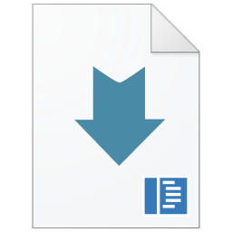
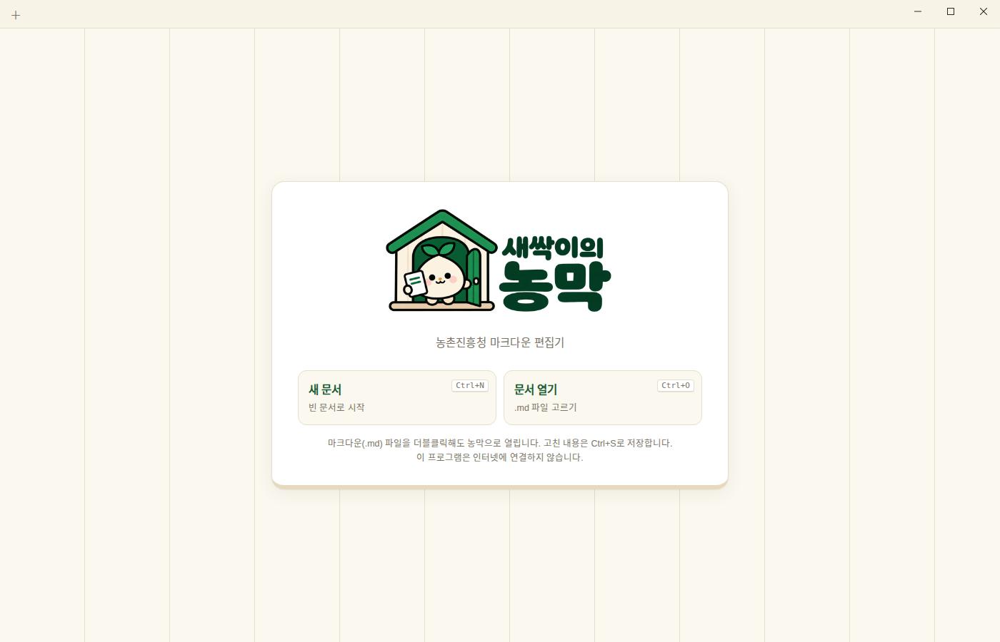
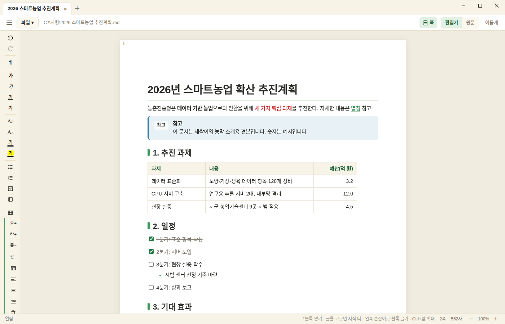
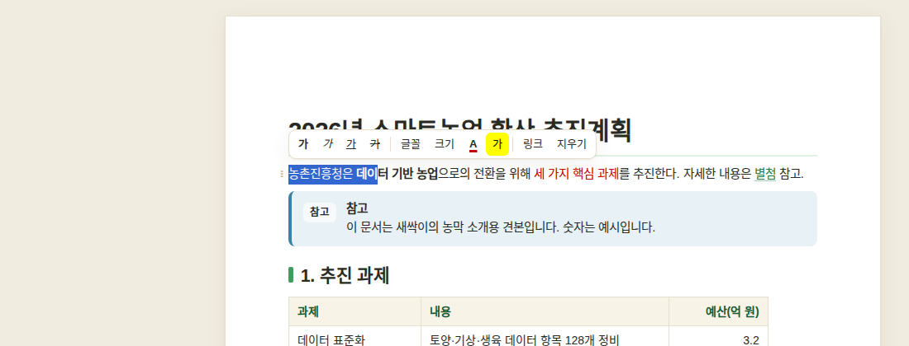
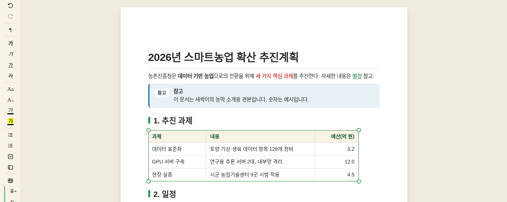
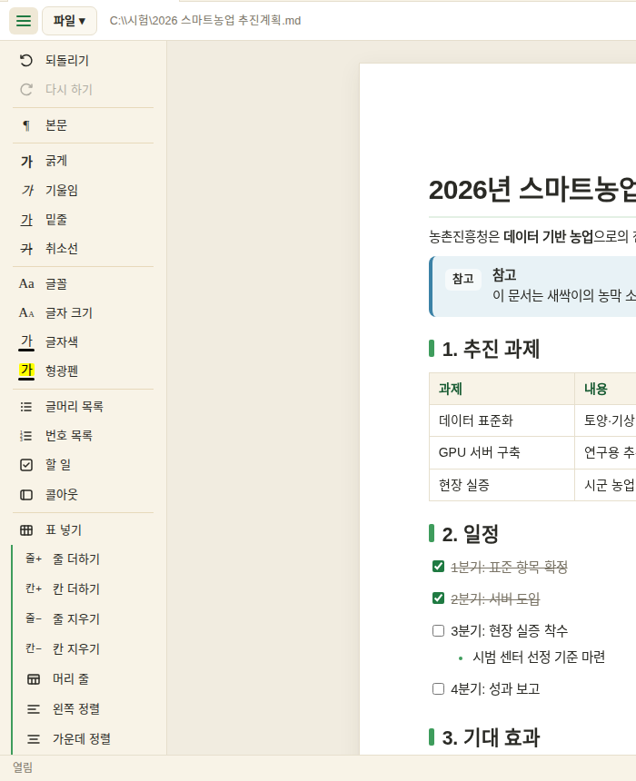
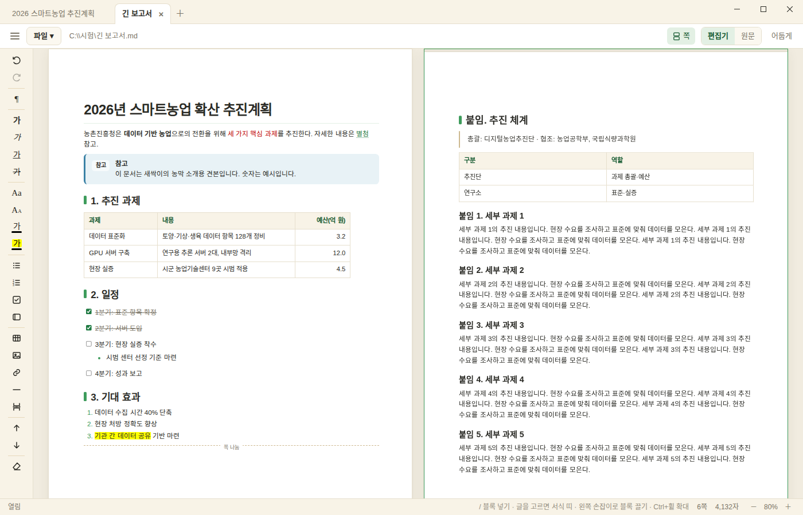
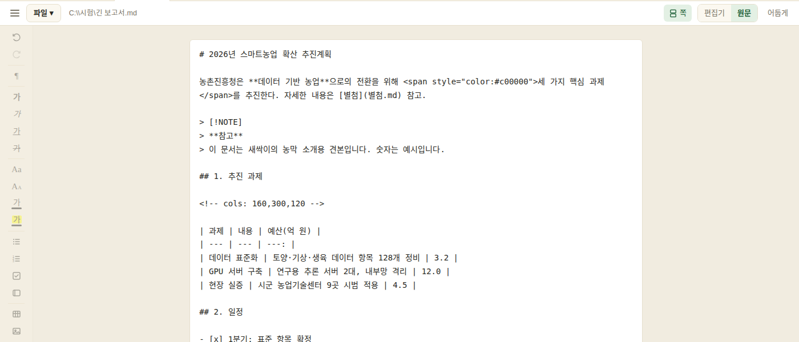

<p align="center">
  &nbsp;&nbsp;&nbsp;&nbsp;
  
</p>
<p align="center">
  
</p>

<h1 align="center">새싹이의 농막 <sub>nongmark</sub></h1>
<p align="center"><b>인터넷이 없어도, 아무것도 깔 수 없어도, 마크다운은 써야 하니까.</b><br>
농촌진흥청 내부망용 마크다운 편집기 · Windows 10/11 · 오프라인 · Apache-2.0</p>

---

## 왜 만들었나

농촌진흥청 내부망은 인터넷이 끊겨 있습니다. 보안을 위해 당연한 일이지만, 덕분에 이런 일이 생깁니다.

- AI가 써 준 보고서 초안, 회의록, 기술 문서가 전부 **마크다운(.md)** 으로 옵니다.
- 내부망 PC에서 .md를 더블클릭하면… 메모장이 열립니다. `#`과 `|---|`가 그대로 보이는 채로.
- 그렇다고 편집기를 깔자니 인터넷도 안 되고, 설치 승인도 받아야 하고, "이 프로그램이 밖으로 뭘 보내지는 않나" 검토도 필요합니다.
- 결국 메모장에서 `**굵게**`를 손으로 세며 고치거나, 한글(hwp)로 옮겨 적는 일이 반복됩니다.

그래서 **직접 만들었습니다.** 처음부터 내부망을 전제로 — 네트워크 코드가 아예 없고, 연 문서가 든 폴더 밖은 건드리지 않으며,
설치 파일 하나로 끝나고, 결과물은 한글(hwpx)·PDF로 바로 나갑니다. 보안성 검토를 두 차례 거쳤고 그 기록도 함께 둡니다.

## 이름에 대하여

- **새싹이**는 농촌진흥청의 마스코트입니다. 농촌진흥사업 전 과정의 AI 대전환 프로젝트 이름이 **'AI 새싹이'** 라서, 그 새싹이가 쓰는 도구라는 뜻으로 데려왔습니다.
- **농막**은 농사일 하다 잠깐 들어가 쉬고 연장을 손보는 작은 집입니다. 농촌진흥청이 만든 **마크다운 편집기(농+마크)** 이자, **새싹이가 작업하는 농막**이라는 두 뜻을 담았습니다.
- 영어 이름은 **nongmark** — 농(nong) + mark(down). 실행 파일과 설치 프로그램 이름입니다.

아이콘도 둘입니다. **프로그램**은 초록 네모, **문서**는 접힌 종이 꼴 — 실행 파일인지 문서인지 한눈에 구분됩니다.

<p align="center">
  &nbsp;&nbsp;&nbsp;&nbsp;&nbsp;&nbsp;
  
</p>

설치하면 탐색기의 `.md` 파일 아이콘이 Windows 기본 모양에서 새싹이 문서 아이콘으로 바뀝니다.

<p align="center">
  &nbsp;&nbsp;&nbsp;<b>→</b>&nbsp;&nbsp;&nbsp;
  
</p>

<p align="center"></p>

## 생김새

문서는 **A4 쪽 단위**로 보입니다(좌우 20mm·위아래 30mm). 공무원 문서는 쪽으로 생각하니까요. 마크다운 문법은 숨어 있고, 한글·워드처럼 글 위에서 바로 고칩니다.

<p align="center"></p>

글을 고르면 그 자리에 서식 띠가 뜹니다. 굵게·기울임·밑줄·취소선·글꼴·크기·글자색·형광펜·링크.

<p align="center"></p>

표는 커서를 두면 테두리와 모서리 손잡이가 생겨 **끌어서 크기를 바꾸고**, 열 경계를 끌어 열 하나만 넓힐 수도 있습니다. 왼쪽 도구 막대는 표 안이면 표 도구(줄·칸 넣기/지우기, 머리 줄, 정렬)로, 그림이면 그림 도구(정렬·너비·설명)로 바뀝니다.

<p align="center"></p>

왼쪽 도구 막대는 평소엔 아이콘만, ☰ 를 누르면 이름이 함께 펼쳐집니다.

<p align="center"></p>

창 폭에 쪽 두 장이 들어가면 **1·2쪽, 그 아래 3·4쪽**으로 놓이고 그대로 편집됩니다. 배율 숫자를 누르면 "두 쪽 폭 맞춤"이 있습니다.

<p align="center"></p>

마크다운 원문이 보고 싶으면 **원문** 모드. 파일은 언제나 평범한 .md라 다른 어디서든 열립니다.

<p align="center"></p>

## 할 수 있는 것

| | |
|---|---|
| **열기·저장** | 탭으로 여러 문서, .md 더블클릭으로 바로 열기, Ctrl+S 저장(자동 저장 없음 — 한글처럼), 닫을 때 저장 여부 묻기 |
| **편집** | 제목·목록·번호·할 일·인용·콜아웃(참고/팁/중요/주의/경고)·코드·표·그림·구분선·쪽 나누기, `/` 메뉴, 블록 끌어 옮기기(⋮⋮ 또는 Alt+↑↓), 되돌리기 |
| **서식** | 굵게·기울임·밑줄·취소선·글꼴·크기·글자색·형광펜 — 마크다운에 없는 것은 `<span style>`로 적혀 Obsidian·Typora에서도 읽힌다 |
| **표** | 모서리 끌어 전체 크기, 열 경계 끌어 열 너비(`<!-- cols -->`로 보존), 줄·칸 넣기/지우기, 머리 줄, 칸 정렬 |
| **그림** | 붙여넣기·끌어다 놓기, 모서리 손잡이로 크기, 정렬·설명(`![설명|480|center]`로 보존) — 문서 옆 `assets/`에 저장 |
| **내보내기** | **한글(hwpx)** — 표는 진짜 한글 표로, 색·글꼴·그림까지 · **PDF/인쇄** — 화면과 똑같은 쪽 나눔 |
| **보기** | A4 쪽 보기 / 쪽 나눔 끄기(이어지는 한 장), 두 쪽 격자, 확대·축소, 어둡게 |

## 믿어도 되는 이유

- **통신이 없다.** 프로그램에 네트워크 패키지가 들어 있지 않습니다(`go list -deps`로 net·http·tls 0개). 화면 쪽은 CSP `connect-src 'none'`으로 막혀 있고, WebView2가 다른 주소로 이동하려는 시도는 프로그램이 전부 취소합니다.
- **연 폴더 밖은 안 건드린다.** 모든 파일 작업이 Go의 `os.Root`를 거칩니다 — 심볼릭 링크·정션으로 폴더 밖에 닿는 것도 운영체제 수준에서 막힙니다.
- **문서가 프로그램을 공격할 수 없다.** 마크다운 해석기를 직접 썼고, 문서 안 HTML은 글자로만 보입니다(글자 꾸밈용 `<span style>` 등 몇 가지만 값을 검사해 받아들임).
- **들어간 코드는 보이는 것뿐.** 편집 엔진 ProseMirror/Tiptap(MIT)은 버전을 고정해 빌드하고, 묶음 안에 eval·XHR·WebSocket이 있으면 빌드가 멈춥니다. 설치는 NSIS, 레지스트리는 파일 연결과 "앱 및 기능" 항목뿐.
- **검토 기록이 있다.** 독립 검토(별도 검토자)에서 나온 지적을 전부 반영했고, 정리본은 `NOTICE`와 함께 저장소에, 상세 보고서는 기관 내부 문서로 보관합니다.
- **아직 없는 것**: 코드 서명 인증서. 그래서 처음 실행할 때 "확인되지 않은 게시자"가 뜹니다 — 해시(`SHA256SUMS.txt`)로 대조해 주세요. 인증서가 생기면 빌드 한 줄로 서명됩니다.

---

## 설치 파일 (`dist/` 또는 [Releases](https://github.com/soonkun/nongmark/releases))

| 파일 | 쓰임 |
|---|---|
| `nongmark-setup.exe` | **설치 프로그램**(약 2MB). 안에 프로그램과 마이크로소프트가 서명한 WebView2Loader.dll(NuGet `Microsoft.Web.WebView2` 1.0.4258.31)이 들어 있다 |
| `nongmark.html` | 프로그램 없이 Edge·Chrome으로 여는 판(파일 하나 열기·내려받기 저장) |
| `SHA256SUMS.txt` | 위 파일들의 SHA-256 — `certutil -hashfile nongmark-setup.exe SHA256`으로 대조 |

(`nongmark.exe`·`WebView2Loader.dll`도 dist/에 남아 있다 - 설치 없이 폴더째 두고 쓰는 휴대용. 두 파일이 같은 폴더에 있어야 한다.)

## 설치 (한 번)
1. `nongmark-setup.exe`를 실행한다(USB → 바탕화면 등). 해시를 대조한다.
   - 처음 실행할 때 파란 "**Windows의 PC 보호**"(SmartScreen) 창이 뜰 수 있다 - 서명 없는 새 프로그램이라는 뜻이지 악성 판정이 아니다. **추가 정보 → 실행**.
     인터넷에서 받은 zip이라면 풀기 전에 zip 오른쪽 단추 → 속성 → **차단 해제**를 하면 안 뜬다. USB로 옮긴 파일에는 보통 뜨지 않는다.
2. 설치 마법사: 시작 → **설치 범위**(모든 사용자 = `C:\Program Files\Nongmark`, 관리자 승인 / 현재 사용자만 = `%LOCALAPPDATA%\Programs\Nongmark`, 승인 없음) →
   폴더 → 구성 요소(시작 메뉴·바탕화면 바로 가기 선택) → 설치 → 끝(바로 실행 선택).
3. `.md` 파일을 더블클릭하면 농막 창으로 열린다. 설치 뒤에는 **탐색기의 .md 아이콘이 접힌 종이 꼴(문서 아이콘)로 바뀐다**(프로그램 아이콘은 네모 꼴). 바로 안 바뀌면 Windows 아이콘 캐시 때문이니 로그오프 후 다시 로그인한다.
   - 이미 다른 프로그램으로 열리게 정해져 있었다면 한 번만: 파일 오른쪽 단추 → **연결 프로그램** → **다른 앱 선택** → **새싹이의 농막** → **항상 이 앱 사용**. (Windows가 사용자가 고른 연결을 프로그램이 바꾸지 못하게 막는다.)
- **제거**: 설정 > 앱 > "새싹이의 농막" (또는 설치 폴더의 `uninstall.exe`). 바로 가기·연결·설치 폴더가 지워지고 문서(.md)는 남는다.
  WebView2 캐시(`%LOCALAPPDATA%\Nongmark`)는 남으니 필요하면 손으로 지운다. 옛 이름(nongmak)으로 설치했던 등록은 설치 때 정리된다.
- 화면을 그리는 **WebView2 런타임**이 필요하다. Windows 11에는 기본으로 있고, Windows 10도 대부분 있다(Edge·Office가 함께 깐다). 없으면 농막이 그렇게 알려 주니, 전산 담당에게 "WebView2 런타임 오프라인 설치 파일(Evergreen Standalone x64)" 설치를 요청한다.

## 쓰는 법 (자세히)
- **대문**: 열 문서 없이 실행하면(또는 탭을 다 닫으면) 새 문서·문서 열기·최근 문서 8개가 있는 대문이 뜬다.
- **화면**: 맨 위 줄은 열린 문서 **탭**(＋ 새 문서, × 닫기, 저장 안 된 문서는 ● 표시, Ctrl+Tab으로 넘기기, Ctrl+W 닫기) - 메모장처럼 이 줄이 곧 창의 제목 줄이다
  (시스템 제목 줄 없음: 빈 곳을 끌면 창이 움직이고 두 번 누르면 최대화, 오른쪽 끝에 최소화·최대화·닫기, 위쪽 가장자리를 끌면 높이 조절). 그 아래 **파일** 메뉴와 문서 경로,
  오른쪽에 **편집기 | 원문** 모드. 왼쪽 **도구 막대**는 아이콘만 보이고 ☰ 를 누르면 이름이 함께 펼쳐진다. 폴더 보기는 없다 - 문서는 열기(Ctrl+O)나 더블클릭으로 연다.
  문서 안의 다른 `.md` 링크는 Ctrl+클릭하면 새 탭으로 열린다.
- **쪽 단위 편집(기본)**: 화면이 A4 쪽(210×297mm)으로 나뉘어 보인다. 여백은 좌우 20mm·위아래 30mm, 본문 11pt·줄 간격 160%(한글로 내보낼 때와 같다). 쪽 아래에 쪽 번호.
  내용이 넘치면 다음 쪽으로 넘어가고, `/` 메뉴의 **쪽 나누기**로 원하는 곳에서 쪽을 나눈다(파일에는 `<!-- pagebreak -->`로 적힌다 - 다른 마크다운 뷰어에서는 보이지 않는 주석).
- **파일 메뉴**: 새 문서(Ctrl+N) · 열기(Ctrl+O) · 저장(Ctrl+S) · 다른 이름으로 저장(Ctrl+Shift+S) · **한글(hwpx)로 내보내기** · **PDF로 내보내기** · **인쇄**(Ctrl+P) · 문서 닫기(Ctrl+W).
  고친 내용은 **Ctrl+S를 눌러야 저장**된다(한글·워드처럼 자동 저장 없음). 저장 안 된 문서는 탭에 ●가 붙고, 탭이나 창을 닫으려 하면 저장 / 저장 안 함 / 취소를 묻는다.
- **한글(hwpx)로 내보내기**: A4·같은 여백의 한글 문서. 표는 한글의 진짜 표(머리 줄 굵게·연초록 바탕, 쪽을 넘으면 머리 줄 반복, 열 너비는 내용 비례, 정렬 반영)로 들어가고, 그림은 문서 안에 넣는다.
  목록·할 일(☐/☑)·인용·콜아웃(색 상자)·코드(회색 상자)·구분선·쪽 나눔도 옮긴다. 글꼴은 맑은 고딕. 쪽 나눔 위치는 한글이 다시 계산하므로 화면과 조금 다를 수 있다.
- **PDF·인쇄**: 편집기 화면 그대로(같은 DOM을 복제해 인쇄) A4로 나간다 - 표 너비·글꼴·간격이 화면과 같고, 쪽은 화면의 쪽 경계에서 넘어가며 긴 표는 줄 단위로 잘려 머리 줄이 반복된다.
  인쇄 미리보기에서 프린터를 고르고, PDF는 "PDF로 저장"(또는 Microsoft Print to PDF)을 고른다 - Windows 10·11에 기본으로 있다. 쪽 번호는 화면에만 있고 PDF에는 안 찍힌다(브라우저 인쇄 엔진 한계).
- **편집기**(기본): 한글·워드처럼 글 위에서 바로 고친다. 마크다운 문법을 몰라도 된다. 바탕은 ProseMirror(뉴욕타임스·GitLab·Atlassian 편집기의 엔진)다.
  - 글을 고르면 그 자리에 **서식 띠**(굵게·기울임·밑줄·취소선·글꼴·크기·글자색·형광펜·링크·지우기)가 뜬다. 왼쪽 도구 막대에도 같은 것이 있고,
    표 안에 커서가 있으면 **표 도구**(줄·칸 더하기/지우기, 머리 줄, 칸 정렬, 표 지우기), 그림을 고르면 **그림 도구**(왼쪽/가운데/오른쪽, 너비, 설명, 지우기)가 나타난다.
  - **표**: 커서가 표 안에 있으면 표 둘레에 테두리가 생기고 **네 모서리를 끌어 표 전체 너비**를 바꾼다(열은 같은 비율로). 열 경계를 끌면 열 하나만 바뀐다. 너비는 `<!-- cols: … -->` 주석으로 파일에 남는다. Tab으로 칸 이동. **그림**: 모서리 점을 끌어 크기를 바꾸고, 붙여넣기·끌어다 놓기로도 넣는다
    (문서 옆 `assets/`에 저장. 너비·정렬은 ``로 남는다). **블록 옮기기**: 블록 왼쪽의 ⋮⋮ 손잡이로 끌거나 Alt+↑/↓.
  - 글자색·형광펜·글꼴·크기는 마크다운에 없어 `<span style="color:#c00000">…</span>` 꼴(Obsidian·Typora가 읽는 꼴)로 파일에 적힌다. 다른 뷰어에서는 색 없이 보일 수 있다.
    받아들이는 값은 색(#rrggbb·rgb())·글꼴 이름·크기(pt·px)뿐이고, 그 밖의 HTML은 글자로 보인다.
- **원문**(오른쪽 위 전환): 문서 전체를 마크다운 글로 보고 고친다.
- **확대·축소**: 문서 위에서 Ctrl+마우스 휠(10%씩), Ctrl+0은 100%, 상태 줄의 배율 숫자를 누르면 **한 쪽 폭 맞춤 / 두 쪽 폭 맞춤**과 자주 쓰는 값을 고른다. **창 폭(도구 막대 제외)에 쪽 두 장이 들어가면(배율과 무관, 넓은 화면은 100%에서도) 1·2쪽, 그 아래 3·4쪽… 격자로 놓이고 그대로 편집된다**(커서가 있는 쪽이 진짜 편집기, 나머지는 복제본 - 누르면 그 쪽으로 옮겨 간다).
- **쪽 나눔 끄기**: 메뉴 줄 오른쪽 **쪽** 단추로 끄면 쪽 경계 없이 내용 길이대로 이어지는 한 장(노션·옵시디언처럼)으로 본다. 설정은 기억된다.
- **쪽 보기**: 편집기는 한 흐름이고, 블록 높이(문단 사이 여백 포함)를 재어 쪽 경계(여백·쪽 번호)를 그 사이에 그린다. 두 쪽 미리보기도 같은 DOM을 쪽 경계에서 잘라 보여 준다.
- **`/` 메뉴**: 빈 블록에서 `/` → 제목·목록·할 일·인용·콜아웃·코드·표·구분선·쪽 나누기.
- Enter 다음 문단 · Shift+Enter 줄바꿈 · 목록에서 Tab/Shift+Tab 들여쓰기 · Ctrl+B/I/U · Ctrl+Z/Y 되돌리기 · `# `·`- `·`1. `·`> `·`---`를 치면 바로 그 블록이 된다.
- 할 일 체크, 그림 붙여넣기(문서 폴더의 `assets/`에 저장), 어둡게.
- 바깥 주소(https://…) 링크는 열지 않고 주소만 복사한다.

## 보안 설계 (자세히)
- **통신이 없다**: 프로그램에 통신 패키지가 들어 있지 않다(`go list -deps`로 net·http·tls 0개 확인). 서버도 포트도 열지 않는다 — 화면과 프로그램은 같은 프로세스 안에서 WebView2의 메시지로 함수를 주고받는다. 화면의 CSP는 `connect-src 'none'`이고 외부 글꼴·그림·스크립트를 모두 막는다. 시험에서 바깥 요청 0건.
- **들어간 코드**: Go 표준 라이브러리 + 우리가 쓴 코드 + WebView2 COM 래퍼(go-webview2, MIT)를 `app/internal/`에 **소스째 들여와 검토·수정**한 것 +
  편집기 엔진 ProseMirror/Tiptap(MIT, `web/editor-app/package-lock.json`에 버전 고정, 이 서버에서 한 번 묶어 `dist/`에 넣고 SHA-256을 기록).
  편집기 묶음은 빌드 때 eval·new Function·XMLHttpRequest·WebSocket이 있으면 멈추도록 검사하고, 어차피 CSP가 연결을 막는다. 원래 래퍼는 WebView2Loader.dll을 exe 안에 넣었다가 메모리에서 바로 올렸는데(백신이 악성코드 수법으로 보는 방식), 그 부분을 지우고 마이크로소프트가 서명한 DLL을 exe 옆에서 전체 경로로만 불러오게 바꿨다. golang.org/x/sys도 쓰지 않는다(그것이 net 패키지를 끌고 들어와 표준 syscall 위의 작은 대용품으로 바꿨다).
- **악성 문서 방어**: 마크다운 해석기를 직접 썼고, 편집기도 그 해석기로 읽은 것만 보여 준다(원문 HTML을 편집기에 그대로 넣지 않는다). 문서 안의 HTML은 글자로만 보이고(글자 꾸밈용 `<span style>`·`<u>`·`<br>`만, 값을 검사해 우리가 다시 조립한 것으로), 링크는 http/https/mailto/상대 경로만(`/\서버` 같은 우회도 차단), 그림은 폴더 안 래스터 그림만(SVG·외부 그림 차단). 공격 문자열 26종·느려지게 만드는 입력(ReDoS) 시험 통과. 화면 스크립트·스타일은 SHA-256 해시가 맞아야만 실행된다.
- **파일 접근 제한**: 사용자가 연 문서가 든 폴더(탭마다 다를 수 있다 - 열 때마다 등록) 안의 .md·그림만. 모든 파일 작업이 Go의 `os.Root`를 거쳐 심볼릭 링크·**정션(mklink /J)**으로 폴더 밖에 닿는 것을 운영체제 수준에서 막는다. `..`·절대 경로·드라이브·네트워크 경로(UNC)·대체 데이터 스트림·장치 이름(CON, COM¹ 등)도 거절. 지우기는 파일 하나씩만. 쓰기는 임시 파일 → 바꿔 끼우기.
- **창은 어디로도 가지 않는다**: WebView2의 NavigationStarting에서 about:blank(우리 화면) 말고는 전부 취소, NewWindowRequested는 처리됨, 브라우저 단축키(F5·Ctrl+R·Alt+←)는 화면에서 막고,
  WebMessage는 about:blank에서 온 것만 받는다. 화면 쪽에서도 모든 링크 클릭·파일 드롭의 기본 동작을 막고 `window.open`을 빈 함수로 덮는다.
  최근 문서 목록은 프로그램이 `%LOCALAPPDATA%\Nongmark\recent.json`에 보관하고 화면은 번호로만 고른다(화면이 임의 경로를 열 수 없다). 탭을 다 닫은 폴더는 등록을 푼다.
- **창**: 시스템 제목 줄은 WM_NCCALCSIZE로 위쪽만 떼어 냈다(창 스타일은 그대로라 테두리·그림자·화면 끝 붙이기 유지). 화면이 부탁하는 창 조작(`nm_win`)은 끌기·위쪽 크기 조절·최소화·최대화·닫기뿐.
- **설치**: NSIS 설치 프로그램(`installer/nongmark.nsi`, 전부 그 파일에 있다). 서비스·시작 프로그램·예약 작업 등록 없음. 레지스트리는 파일 연결 키(`Software\Classes`)와 "앱 및 기능" 항목(`…\Uninstall\Nongmark`)뿐이고, 범위는 사용자가 고른다(모든 사용자 = HKLM·Program Files, 관리자 승인 1회 / 현재 사용자 = HKCU·LOCALAPPDATA). 프로그램 자체에는 설치 코드가 없다. 시스템 DLL은 System32 전체 경로로만.
- **CSP**: 스크립트는 해시가 맞는 두 덩이(편집기 묶음, 화면 코드)만 돈다. 스타일은 `'unsafe-inline'`을 허용한다 - 편집기가 글자색·표 너비·손잡이 위치를 style 속성으로 그리기 때문인데,
  스타일은 코드를 실행하지 못하고 연결(connect/img/font-src)이 모두 막혀 있어 새어 나갈 길이 없다.
- **독립 검토**: 1차(09-말) 지적 정션 탈출·느려짐(ReDoS)·백슬래시 링크 우회·장치 이름 누락, 2차(10-03, 편집기 교체 뒤) 지적 이동 미차단·바인딩 전 문서 주입·
  임의 경로 최근 문서·UNC 저장·닫기 응답 의존을 모두 고쳤다. 남긴 것: 코드 서명 없음(인증서 없음 - 해시로 대조), 끌기 손잡이 확장이 끌고 오는 yjs 협업 코드(통신 코드 없음, 미사용).
- **재현 가능한 빌드**: 같은 소스면 바이트까지 같은 exe(`CGO_ENABLED=0 -trimpath -buildid=`).
- **코드 서명**: 인증서가 없어 아직 서명하지 않았다 → 설치 때 "확인되지 않은 게시자"로 뜬다. 기관 코드 서명 인증서(.pfx)가 생기면
  `NONGMARK_SIGN_PFX=인증서.pfx NONGMARK_SIGN_PASS=… python3 build.py`로 exe·설치 프로그램이 서명되어 "게시자: 농촌진흥청"이 뜬다(osslsigncode). 그 전에는 해시로 무결성을 확인한다.

## 빌드 (개발 서버에서만)
```
(cd web/editor-app && npm ci)          # 처음 한 번: 편집기 엔진(버전 고정) 받기 - node는 opt/node22
python3 build.py                       # 편집기 묶음(esbuild) → 금지 API 검사 → HTML·CSP → 아이콘(windres) → go test/vet → Windows exe → 설치 프로그램(makensis) → SHA256SUMS
node --test tests/markdown.test.cjs    # 해석기 보안 시험
../.tools/pw/bin/python tests/e2e.py   # 화면 시험(Chromium, 프로그램 함수는 가짜로) - 탭·서식 편집·쪽 나누기·긴 표·두 쪽 보기·hwpx 내보내기
node tests/hwpx.test.cjs build/sample.hwpx && ../news-briefing/.venv/bin/python tests/hwpx_check.py build/sample.hwpx   # hwpx 구조 검증(python-hwpx)
```
한글 문서 골격(`assets/hwpx-template`)은 python-hwpx(Apache-2.0)의 빈 문서에서 땄다.
도구: Go 1.27.1(go.dev 공식, SHA-256 대조), `binutils-mingw-w64`의 windres(Ubuntu), NSIS 3.09(Ubuntu `nsis`), 아이콘은 `make_icon.py`(Pillow).
**아직 실제 Windows에서 돌려 보지 못했다** — 이 개발 서버에는 Windows가 없다. 첫 설치 때 창이 뜨는지, .md 더블클릭·저장이 되는지 확인이 필요하다.

## 라이선스
Apache License 2.0 (`LICENSE`). 들어간 제3자 소프트웨어와 그 라이선스는 `NOTICE`에 적혀 있다.
